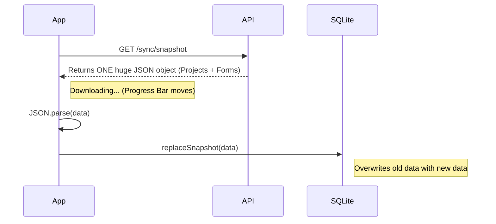

# How FMR Data Sync Works

## The "Snapshot" Strategy

Currently, your app uses a **Bulk Download** strategy (Snapshot), not a 1-by-1 download.

### 1. The Process
1. **Request**: App asks server for `GET /sync/snapshot`.
2. **Package**: Server gathers **ALL** your projects, forms, and drafts into one single JSON object.
3. **Download**: App downloads this one large file.
   - *This is where we show the progress bar (e.g., 5MB / 10MB downloaded).*
4. **Save**: App saves the entire JSON object into SQLite.

### 2. Visualizing the Data Flow



### 3. Why this approach?

| Feature | Bulk Snapshot (Current) | 1-by-1 Download (Alternative) |
| :--- | :--- | :--- |
| **Speed** | ✅ **Faster** (1 request overhead) | ❌ Slower (1000s of requests overhead) |
| **Complexity** | ✅ **Simple** (Easy to code) | ❌ Complex (Need to manage queues) |
| **Integrity** | ✅ **Atomic** (All or nothing) | ⚠️ Risk of partial/incomplete data |
| **Large Data** | ⚠️ **High RAM usage** (Holds all data in memory) | ✅ Low RAM (Process one at a time) |

### 4. Code Reference

**Downloading (One Request):**
```typescript
// api.ts
const xhr = new XMLHttpRequest();
xhr.open('GET', `${apiBaseUrl}/sync/snapshot`); // One call
```

**Saving (One Write):**
```typescript
// offline-store.ts
await storage.setItemAsync(SNAPSHOT_KEY, JSON.stringify(snapshot)); // One save
```

### 5. Future Scalability
If your data grows huge (e.g., >50MB or >10,000 projects), this approach might cause the app to freeze during `JSON.parse`. In that case, we would switch to **Pagination**:
1. Download Page 1 (Projects 1-100) -> Save
2. Download Page 2 (Projects 101-200) -> Save
3. ...

**For now, the Snapshot approach is efficient and reliable for typical FMR workloads.**
